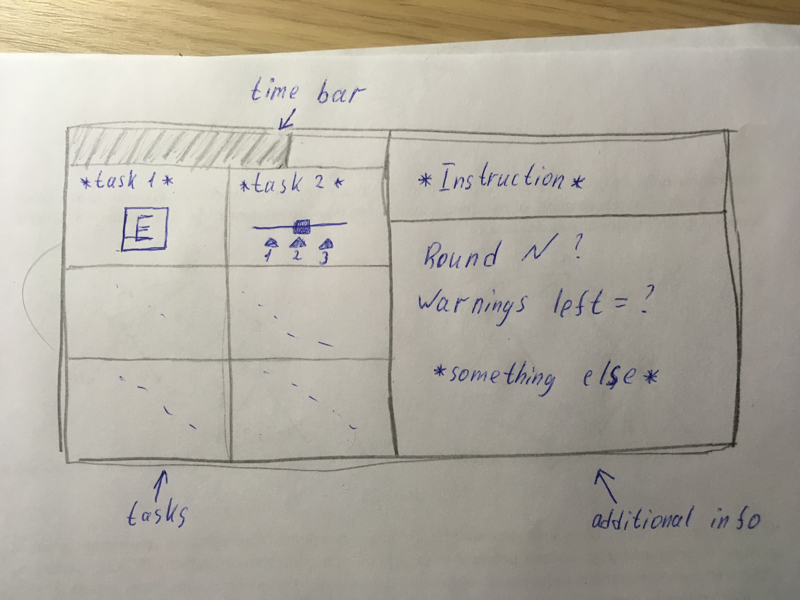

 

Инструкцией, здесь и дальше, я буду называть то задание, которое дается
игроку Х, которое он затем сообщает всем, чтобы его выполнили. time bar
относится к нему же.

Начало игры 
===========

Игрок открывает игру – попадает на экран меню. При нажатии на кнопку
**Connect** отправляет запрос на сервер, подключается к нему и попадает
в лобби. Лобби представляет собой страничку с настройками: сложность
игры, длительность раунда, конструктор собственных заданий и кнопку
**Ready**. Когда все игроки подсоединяются к лобби, первый игрок сможет
нажать кнопку **Start**, чтобы начать игру. На сервер отправляется
сигнал о начале игры.

Про конструктор заданий 
=======================

Игрокам предоставляется возможность создать собственные задания, которые
будут появляться во время игры в перемешку с остальными. В этом
конструкторе игрок должен:

-   Написать текст инструкции, которая будет появляться у игрока,
    которому выпадает это задание.

-   Количество заданий, необходимых для выполнения этой инструкции; их
    порядок.

-   “Инструмент” для выполнения этого задания (то, что будет отображться
    на экране, а не то, что необходимо сделать игроку) – клавиша
    клавиатуры, компьютерной мыши, соединение/разъединение проводов и
    т.д.

-   Размер этого “инструмента” на экране.

-   Что необходимо сделать игроку, чтобы выполнить задание – нажать
    определенную клавишу на клавиатуре, нажать на задание мышью и т.д.

-   Текст самих заданий.

-   Время на их выполнение.

Новые задания посылаются на сервер.

Игра 
====

На сервере из базы заданий выбираются определенное количество для
игроков. Эти задания распределяются между всеми игроками, состояния
игроков посылаются сервером. На экранах отображается интерфейс (Рис.1).
Игроки взаимодействуют, выполняют задания, изменненые состояния игроков
отправляются на сервер, где проверяется корректность выполнения заданий.
Меняется состояние игры – уменьшается время, количество заданий,
раздаются новые в случае корректного выполнения прошлых. Новые состояния
игроков посылаются сервером. И так циклом.

Конец игры 
==========

Отображается **Victory** или **Defeat** в зависимости от исхода игры.
Ниже приведена статистика (количестов набранных очков) всех игроков в
зависимости от количества выполненных ими заданий.

Внизу кнопки **Back to Lobby** и **Exit**.

Поподробнее про алгоритм игры
=============================

Начинается игра, всего N игроков. Из общей базы заданий ( : как хранятся
задания?) выбираются случайно $6N$ объектов класса Tasks и
распределяются между игроками.

У нас есть два массива заданий:

-   tasks\_to\_be\_done – в нем хранятся активные задания, которые
    игрокам необходимо выполнить

-   done\_tasks – задания, которые прямо сейчас не участвуют в игре

После выдачи распределения заданий и генерации активных инструкций
начинается игра. Сервер передает игрокам их объекты класса Player,
фиксирует их действия и посылает обратно на сервер. На сервере мы
проходимся по массиву **done\_tasks**, и смотрим на изменение состояний
заданий. Если мы замечаем, что состояние какого-либо задания изменилось,
то штрафуем игрока (понижаем его очки).

Далее проходимся по массиву ** tasks\_to\_be\_done** и также смотрим на
изменение состояний заданий. Далее возможны несколько возможных
вариантов событий:

-   Задание не выполнено – уменьшаем время, оставшееся на его выполнение

-   Задание выполнено – вознаграждаем игроков, выполнивших инструкцию, и
    заменяем его на другую инструкцию из массива **done\_tasks**.
    Уменьшаем оставшееся количество заданий для перехода на следующий
    раунд.

-   Истекло время на выполнение задания – добавляем выговор в объекте
    класса **CurrentGameState**, и так же меняем это задание на другое

Проверяем, не выполнены ли все задания этого раунда, если так, то
переходим на следующий раунд, обнуляем все значения и начинаем заново,
но время на выполнение заданий меньше.
